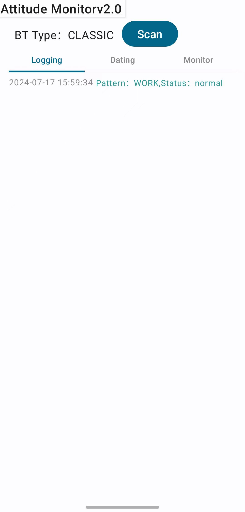
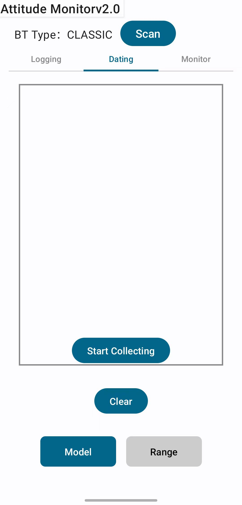
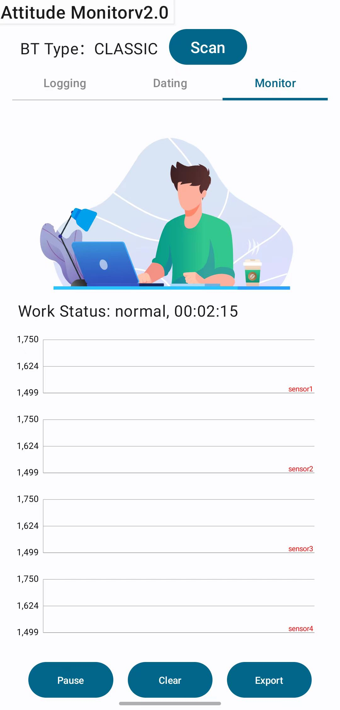
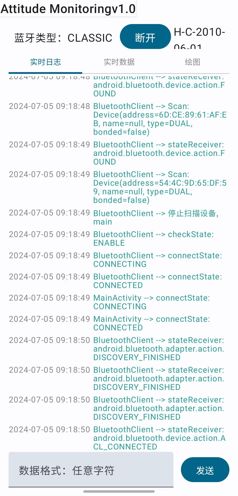
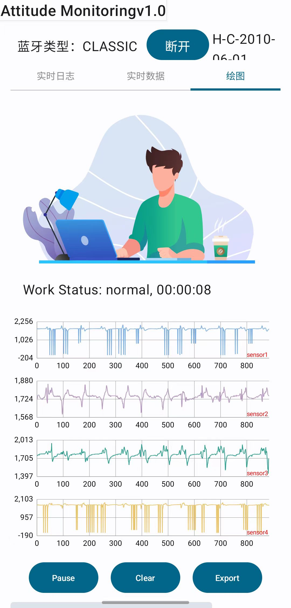

## 项目实现进展

项目需求见：[requestments.md](requirements.md)

传感器采用TENG，一种柔性传感，用于获取颈部的姿态，如低头，抬头，转头等，不同姿态下维持特定时间会进行报警。

> 2024-06-21：完成蓝牙通信，数据获取，多折线图绘制和日志等功能
>
> 2024-06-22：更改需求为4折线，判断传感器状态，制作多个动图。
>
> 2024-07-01：增CNN模型对传感器结果进行实时推测。
>
> 2024-07-10：可以自用采用阈值判断，对传感器状态进行推测，解决通信时卡死的现象。
>
> 2024-07-11:  增加切换模型预测和范围预测的组件。

## UML


## UI

英文版界面：

<div style="display: flex; justify-content: space-between;">
    
    
    
</div>

英文版没有进行实测，所以展示中文的实测图：

<div style="display: flex; justify-content: space-between;">
    
    
</div>

## 架构--MVVM

绘制折线图：采用API-->[MPAndroidChart](https://github.com/PhilJay/MPAndroidChart) ，由于要用动态获取，数据量大且要切换Actually，所以采用了MVVM模式。

**Model**，创建动态折线图类[LineChartHander](AttitudeMonitoring/app/src/main/java/com/example/attitudemonitoring/handler/LineChartHandler.kt)，再用[MultiLineChartHandler](AttitudeMonitoring/app/src/main/java/com/example/attitudemonitoring/handler/MultiLineChartHandler.kt)将创建多个折线图，并将折线图与数据绑定。

**ViewModel**，用于管理折线图和传感器数据，避免在切换页面时数据丢失，在多折线图，数据量大时造成卡顿，[MultipleLineChartsViewModel](AttitudeMonitoring/app/src/main/java/com/example/attitudemonitoring/viewModel/MultipleLineChartsViewModel.kt)继承了Android的ViewModel框架，用[ViewModelFactory](AttitudeMonitoring/app/src/main/java/com/example/attitudemonitoring/viewModel/ViewModelFactory.kt)即工厂方法的模式进行创建。

**View**：视图，在[LineChartsView.kt](AttitudeMonitoring/app/src/main/java/com/example/attitudemonitoring/ui/widgets/LineChartsView.kt)文件中，函数`LineChartView`创建1个折线图，`MultipleLineChartsView`创建了8个折线图，可以开始，停止，清空，重启，最后数据还可以导出到社交媒体中。

蓝牙数据展示：

**Model**, 采用API-->[BluetoothClient: Android蓝牙客户端)](https://github.com/zhzc0x/BluetoothClient)

**ViewModel**，在DataReaderViewModel内；

**View**，视图-->DataReaderScreen.kt

采用SharedViewModel实现两个ViewModel进行通信，利用工厂方法构建ViewModel。

```kotlin
class ViewModelFactory(
    private val context: Context,
    private val sharedViewModel: SharedViewModel,
    private val bluetoothType: ClientType = ClientType.CLASSIC,
    private val bluetoothClient: BluetoothClient = BluetoothClient(context,bluetoothType,null),
    private val readCharacteristic: Characteristic? = null
) : ViewModelProvider.Factory {
    override fun <T : ViewModel> create(modelClass: Class<T>): T {
        return when {
            modelClass.isAssignableFrom(MultipleLineChartsViewModel::class.java) -> {
                MultipleLineChartsViewModel(context,sharedViewModel) as T
            }
            modelClass.isAssignableFrom(DataReaderViewModel::class.java) -> {
                DataReaderViewModel(bluetoothType, bluetoothClient, readCharacteristic,sharedViewModel) as T
            }
            else -> throw IllegalArgumentException("Unknown ViewModel class")
        }
    }
}

```


## 动画以及更多

```bash
cd AttitudeMonitoring
python3 -m http.server 8000
```

进入：[http://127.0.0.1:8000/app/src/main/res/raw/animation.html](http://127.0.0.1:8000/animation.html)


两个配置文件是部署在服务器上，其他都可以预览。

## Python构建范围参数和模型

模型在`assests`文件中。

Python代码在[csvAnalysis](csvAnalysis/scientificProject)中，在[scientificProject](csvAnalysis/scientificProject)目录中是阈值分析法，采用滑动窗格，可生成YAML文件。在[data](csvAnalysis/scientificProject/data)文件夹中有数据和生成cnn模型代码，以及利用TensorFlow生成轻量型的模型代码，生成模型适用于智能手机。

## 参考

见文件夹`withGPT`

[Jetpack ViewModel (源码分析) 面试](https://juejin.cn/post/7379823758420148276)
